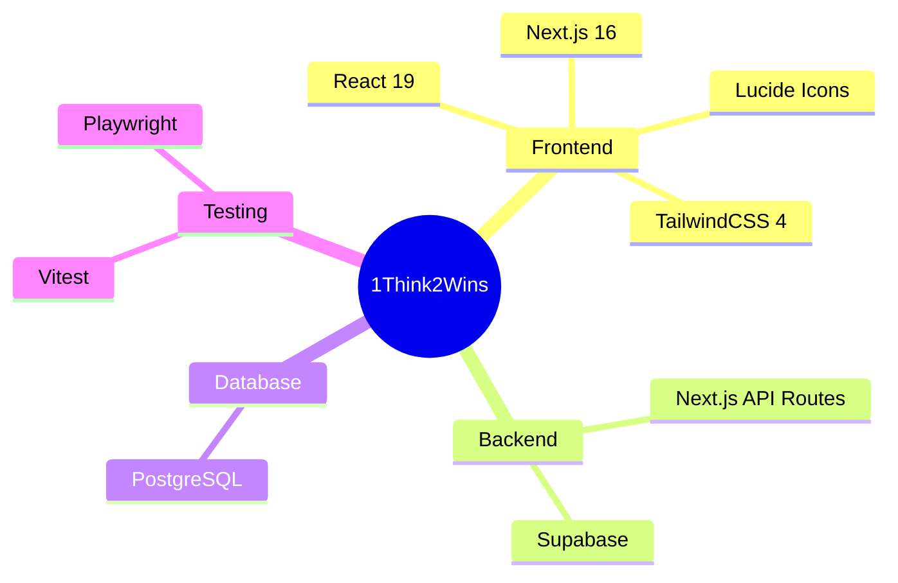

<div align="center">

<!-- Animated Header with Gradient -->


<!-- Animated Typing -->
<a href="#">
  
</a>

<br/>

<!-- Animated Badges -->
<p>
  
  
  
  
  
  
</p>

<!-- Status Badges -->
<p>
  <a href="https://github.com/AunMohammad254/1think2winsx/actions/workflows/tests.yml"></a>
  <a href="https://github.com/AunMohammad254/1think2winsx/actions/workflows/coverage.yml"></a>
  <a href="https://github.com/AunMohammad254/1think2winsx/actions/workflows/performance.yml"></a>
  
</p>

<!-- Divider -->


</div>

---

## 🎯 About The Project

<table>
<tr>
<td>

**1Think2Wins** is a cutting-edge quiz gaming platform where knowledge meets rewards! Players compete in exciting quizzes, earn points, and redeem them for amazing real-world prizes like smartphones, bikes, smartwatches, and more.

<details>
<summary>🌟 <b>Why 1Think2Wins?</b></summary>
<br/>

- 🧠 **Think Smart** - Challenge your knowledge across various topics
- 🎮 **Play Hard** - Compete with players from around the world
- 🏆 **Win Big** - Redeem points for incredible prizes

</details>

</td>
</tr>
</table>


---

## ✨ Features

<div align="center">

| 🎮 **Gaming** | 💰 **Rewards** | 👑 **Competition** |
|:---:|:---:|:---:|
| Interactive Quizzes | Random Prizes | Live Leaderboards |
| Timed Challenges | Points System | Global Rankings |
| Multiple Categories | Prize Redemption | Achievement Badges |

</div>

<details>
<summary><b>🔥 Explore All Features</b></summary>
<br/>

### 🎮 Quiz System
```
📝 Multiple Choice Questions      ⏱️ Timed Quizzes
🎯 Instant Scoring               📊 Progress Tracking
🔄 Dynamic Question Pools        ✅ Admin Evaluation
```

### 💰 Rewards & Prizes
```
🎁 Real Physical Prizes          📱 Smartphones
🚲 Bikes                         ⌚ Smartwatches
🎧 Premium Earbuds               🎮 Gaming Accessories
```

### 👤 User Features
```
🔐 Secure Authentication         📈 Progress Dashboard
🏆 Leaderboard Rankings          💳 Easy Payments
📧 Email Verification            🔔 Notifications
```

### 🛡️ Admin Panel
```
📊 Analytics Dashboard           👥 User Management
❓ Question Management           🎁 Prize Management
💰 Payment Tracking              📺 Live Stream Control
```

</details>

---

## 🚀 Tech Stack

<div align="center">


```mermaid
mindmap
  root((1Think2Wins))
    Frontend
      Next.js 16
      React 19
      TailwindCSS 4
      Lucide Icons
    Backend
      Next.js API Routes
      Supabase
    Database
      PostgreSQL
    Testing
      Vitest
      Playwright
```

</div>

---

## ⚡ Quick Start

<div align="center">

### Prerequisites


</div>

### 📦 Installation

```bash
# Clone the repository
git clone https://github.com/yourusername/1think2winsx.git

# Navigate to project directory
cd 1think2winsx

# Install dependencies
bun install

# Set up environment variables
cp .env.example .env.local
```

### 🔧 Configuration

Create a `.env.local` file with the following:

```env
# Supabase Configuration
NEXT_PUBLIC_SUPABASE_URL="your-supabase-url"
NEXT_PUBLIC_SUPABASE_ANON_KEY="your-anon-key"
SUPABASE_SERVICE_ROLE_KEY="your-service-role-key"

# Authentication (Optional/Fallback)
AUTH_SECRET="your-auth-secret"

# Cron secret for scheduled quiz activation
CRON_SECRET="your-random-secret"

# 💡 Wallet Feature Toggle
# Set to 'false' → quizzes are FREE (wallet & payment gate hidden completely)
# Set to 'true'  → wallet system is active (users pay 2 PKR for 24h quiz access)
WALLET_FEATURE_ENABLED=true
```

### 🗄️ Database Setup

```bash
# Ensure Supabase CLI is installed and linked to your project
supabase link --project-ref your-project-ref

# Push database schema to your remote database
supabase db push
```

### 🚀 Run Development Server

```bash
bun run dev
```

<div align="center">

🌐 Open [http://localhost:3000](http://localhost:3000) in your browser

</div>

---

## 📁 Project Structure

```
📦 1think2winsx
├── 📂 e2e                  # Playwright end-to-end tests
├── 📂 public               # Static assets
│   ├── 🖼️ bike.svg
│   ├── 🖼️ phone.svg
│   └── 🖼️ ...
├── 📂 src
│   ├── 📂 app              # Next.js App Router
│   │   ├── 📂 admin        # Admin dashboard
│   │   ├── 📂 api          # API routes
│   │   ├── 📂 quiz         # Quiz pages
│   │   ├── 📂 leaderboard  # Leaderboard
│   │   ├── 📂 prizes       # Prize catalog
│   │   ├── 📂 profile      # User profile
│   │   └── 📄 page.tsx     # Home page
│   ├── 📂 components       # Reusable components
│   ├── 📂 hooks            # Custom React hooks
│   ├── 📂 lib              # Utility libraries
│   ├── 📂 tests            # Vitest unit tests
│   └── 📂 types            # TypeScript types
├── 📂 scripts              # Development & utility scripts
├── 📂 SQL                  # Supabase schema definitions
├── 📄 middleware.ts        # Next.js middleware
└── 📄 package.json         # Dependencies
```

---

## 📜 Available Scripts

| Command | Description |
|---------|-------------|
| `bun run dev` | Start development server |
| `bun run build` | Build for production |
| `bun run start` | Start production server |
| `bun run lint` | Run ESLint |
| `bun run test` | Run Vitest unit tests |
| `bun run test:e2e` | Run Playwright E2E tests |
| `bun run cleanup:orphaned` | Clean orphaned database records |

---

## 🐳 Docker Deployment

```bash
# Build and run with Docker Compose
docker-compose up -d --build

# View logs
docker-compose logs -f
```

---

## 🗺️ Roadmap

<div align="center">

```
🚀 CURRENT                    📅 PLANNED                   🔮 FUTURE
   │                              │                            │
   ├── ✅ Quiz System            ├── 🔄 Mobile App            ├── 🎮 Multiplayer
   ├── ✅ Points & Prizes        ├── 🔄 Social Features       ├── 🤖 AI Questions
   ├── ✅ Leaderboards           ├── 🔄 Tournaments           ├── 🌍 Multi-language
   ├── ✅ Admin Panel            ├── 🔄 Push Notifications    ├── 📊 Advanced Stats
   └── ✅ Payment System         └── 🔄 Achievement System    └── 🎯 Custom Quizzes
```

</div>

---

## 💳 Wallet Feature Toggle

> The wallet system gates quiz access behind a 2 PKR / 24-hour payment. It can be **fully toggled on/off without touching any code** — no data is ever deleted.

<details>
<summary><b>🔴 Disable Wallet (Free Quiz Access)</b></summary>
<br/>

Set the following in your environment variables (Hostinger hPanel → Environment Variables):

```env
WALLET_FEATURE_ENABLED=false
```

**What gets hidden automatically:**

| Surface | Behaviour |
|---|---|
| Quiz page | Users play **free** — no payment prompt |
| Wallet UI & balance | Hidden completely |
| Navbar wallet links | Hidden |
| Deposit form | Hidden |
| Admin wallet APIs | Return `HTTP 503` (safe) |
| Database (balances, history) | **Untouched — all data preserved** |

</details>

<details>
<summary><b>🟢 Re-enable Wallet (Paid Access)</b></summary>
<br/>

Change the environment variable back to `true` (or remove it entirely):

```env
WALLET_FEATURE_ENABLED=true
```

The change propagates within **60 seconds** — no redeploy needed. All user balances and transaction history are instantly restored since no data was ever deleted.

</details>

---

## 🤝 Contributing

Contributions make the open-source community amazing! Any contributions you make are **greatly appreciated**.

<details>
<summary><b>📝 How to Contribute</b></summary>

1. Fork the Project
2. Create your Feature Branch (`git checkout -b feature/AmazingFeature`)
3. Commit your Changes (`git commit -m 'Add some AmazingFeature'`)
4. Push to the Branch (`git push origin feature/AmazingFeature`)
5. Open a Pull Request

</details>

---

## 📞 Contact & Support

<div align="center">

| Platform | Link |
|:--------:|:----:|
| 📧 Email | [contact@1think2wins.com](mailto:contact@1think2wins.com) |
| 🐛 Issues | [Report Bug](https://github.com/yourusername/1think2winsx/issues) |
| 💡 Feature Request | [Request Feature](https://github.com/yourusername/1think2winsx/issues) |

</div>

---

## 📄 License

<div align="center">

Distributed under the **MIT License**. See `LICENSE` for more information.

</div>

---

<div align="center">

<!-- Animated Footer -->


### 💜 Made with Love for Quizzers Worldwide

<p>
  
  
  
</p>

**⭐ Star this repo if you find it helpful! ⭐**


</div>