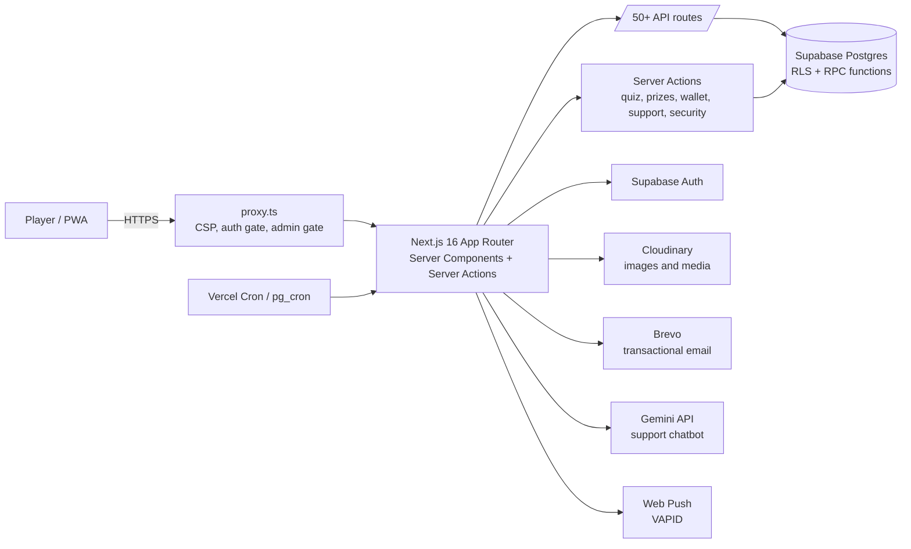

<div align="center">


### 🏏 Pakistan's sports quiz competition: answer, compete, win real prizes

<p>
  
  
  
  
  
  
</p>

<p>
  <a href="https://github.com/AunMohammad254/1think2winsx/actions/workflows/tests.yml"></a>
  <a href="https://github.com/AunMohammad254/1think2winsx/actions/workflows/coverage.yml"></a>
  <a href="https://github.com/AunMohammad254/1think2winsx/actions/workflows/performance.yml"></a>
  
</p>

[About](#-about) · [Latest updates](#-latest-updates) · [Features](#-features) · [Architecture](#-architecture) · [Security](#-security) · [Getting Started](#-getting-started) · [Database](#-database) · [Testing](#-testing--quality) · [Deployment](#-deployment) · [Roadmap](#-roadmap)

</div>

---

## 🎯 About

**1Think2Win** is a Pakistan-based online **sports quiz competition**. Players pay a small entry fee (**2 PKR**), answer sports-knowledge questions within a time limit, and **randomly selected winners receive real prizes** such as motorcycles, smartphones, smartwatches and earbuds. The platform runs 24/7 and includes live-stream quizzes, an AI support assistant, push notifications and a full admin back-office.

| 🧠 Think Smart | 🎮 Play Hard | 🏆 Win Big |
|:---:|:---:|:---:|
| Sports knowledge quizzes | Timed sessions, live leaderboards | Fair random prize draws |

### How it works

1. **Register**: create an account and verify your email.
2. **Browse quizzes**: find live and scheduled sports quizzes.
3. **Pay 2 PKR**: one payment grants **24-hour** quiz access (wallet top-ups via Easypaisa or JazzCash).
4. **Answer**: complete the quiz within the time limit (10 minutes).
5. **Win**: after evaluation, winners are drawn and notified, then claim their prize.

---

## 🆕 Latest updates

Status as of **5 October 2026**: the player app and the full admin back-office are complete, and the production build, type-check, lint and test suite (**241 tests**) pass. The most recent work:

| Area | What changed |
|---|---|
| **Media (Cloudinary)** | Prize images, avatars and the auth logo are served from the Cloudinary CDN (`next-cloudinary`, blur placeholders, face-aware avatar crop). Unused assets are deleted automatically when a prize or avatar is replaced. |
| **Admin media library** | New **Media** module to browse Cloudinary usage and assets and delete files; prize form has inline upload (`/api/upload`). |
| **Quiz lifecycle** | New **Upcoming** status, a per-quiz **time-up display window** (`timeUpDuration`, 1 to 1440 min), a **Push Schedule** admin action, and cron-driven activation and auto-pause. Player cards show *Upcoming*, *Unanswered*, *Answered* or *Time-up*. |
| **Live viewing** | Mobile-first stream player (mobile header, working settings panel, native fullscreen with landscape lock). Quiz screen has a **theater mode**, keeps the **timer visible in landscape** on phones, and drops the stream area when nothing is live. |
| **Landing page** | Hero is now a server component with small client islands (typewriter, particles, CTA); the headline is no longer gated on a scroll observer. Fixed the hero sport balls rendering at 320px instead of 96px. |
| **Navigation speed** | Quiz cards prefetch their route on hover or focus. |
| **Security and email** | Auth-callback open-redirect fix, CSRF hardening, dead session-cookie cleanup, one-click signed newsletter unsubscribe, configurable Brevo sender. |
| **Support tooling** | Admin support desk: user lookup, points and wallet adjustments, suspend or restore, force-verify email, refunds, notes and tags, GDPR export. |
| **Deployment** | Hostinger guide ([`docs/HOSTINGER_DEPLOY.md`](./docs/HOSTINGER_DEPLOY.md)) and scripted build. |
| **Installable app** | `public/manifest.json` (192 and 512 icons) is wired into the root layout. |

> [!NOTE]
> `experimental.optimizeCss` is deliberately **not** enabled: Next needs the `critters` package for it, which is not installed, and it previously broke builds.

---

## ✨ Features

### 🎮 Player experience

- **Quizzes**: browse, filter and join live, upcoming or scheduled sessions; server-enforced one attempt per user per quiz; instant submission feedback and per-quiz results pages.
- **Live quiz push**: admins push a quiz live and players are alerted instantly (in-app and web push).
- **Live streaming**: embedded live streams (YouTube, Facebook, Twitch or custom embed) shown to players while a quiz runs, with theater mode on large screens and a landscape-friendly layout on phones.
- **Leaderboards**: podium view plus ranked rows with animated scores, filterable by timeframe (all-time and others) or by quiz, served from a precomputed cache.
- **Wallet**: balance, deposit requests and transaction history; quiz access is paid atomically from the wallet.
- **Prizes and claims**: prize catalog, redemption form with proof, claim status tracking (pending, approved and so on) and claim history.
- **Profile**: avatar upload (Cloudinary), edit details, secure password change, stats grid, quick actions.
- **Notifications**: in-app notification bell plus browser **web push** (VAPID).
- **Newsletter**: subscribe and one-click signed unsubscribe links.
- **AI support chatbot**: Gemini-powered assistant that knows the platform (fees, prizes, pages, how to play). It rotates across several Gemini models with a per-IP, per-model token-bucket limiter.
- **PWA**: installable app with a service worker and offline asset caching.
- **Content pages**: How to Play, FAQ, Contact, Terms, Privacy, Disclaimer.
- **Polished landing page**: hero, live quiz teaser, how-it-works, prizes, stats, testimonials, leaderboard preview, scroll progress and section navigation (Framer Motion).

### 🛡️ Admin back-office

Protected by a **separate admin session** (bcrypt-verified credentials, `admin-session` cookie, validated in the layout and in every Server Action).

| Module | What admins can do |
|---|---|
| **Dashboard** | KPI cards, recent activity feed, aggregated analytics (server-side SQL aggregates) |
| **Analytics** | Users, quizzes, revenue and engagement charts; Web Vitals reporting |
| **Quizzes** | Form builder, create, edit, delete, **publish, pause, push live, schedule, push a scheduled quiz**; time-up window per quiz; bulk question management |
| **Questions** | Create, edit and list questions per quiz |
| **Quiz evaluation** | Step-by-step evaluation: mark correct options, finalize scores, set-based and fast |
| **Lucky winner** | Fair random winner draw per quiz |
| **Prizes & claims** | Prize CRUD with Cloudinary images, atomic stock handling, player claims review and approval |
| **Wallet** | Review deposit requests, bulk processing, reconciliation, **wallet feature toggle** |
| **Live streaming** | Manage stream embeds and configuration |
| **Newsletter** | Subscriber list and send campaigns |
| **Notifications** | Send and schedule push or in-app notifications (cron-processed) |
| **Support desk** | Look up users, adjust points or wallet balance, edit profile, reset password, suspend or unsuspend, force-verify email, resend verification, impersonation link, refund attempts, admin notes and tags, **GDPR data export** |
| **Security center** | Security events, stats and **fraud alerts** |
| **Media** | Cloudinary usage and asset browser with delete |
| **DB stats** | Database health and size insights |

### 💳 Wallet feature toggle

The wallet gate (2 PKR for 24 h access) can be switched on or off **without a deploy**.

| `WALLET_FEATURE_ENABLED` | Behaviour |
|---|---|
| `true` (default) | Users pay from their wallet to unlock quizzes; wallet UI and deposits visible |
| `false` | Quizzes are **free**; wallet UI, navbar links and deposit form hidden; admin wallet APIs return `503` |

It can also be flipped live from the admin panel (`AppSettings`). The value is cached and propagates within about **60 seconds**. **No balances or history are ever deleted**.

---

## 🏗️ Architecture


```mermaid
flowchart LR
    U[Player / PWA] -->|HTTPS| P[proxy.ts<br/>CSP, auth gate, admin gate]
    P --> N[Next.js 16 App Router<br/>Server Components + Server Actions]
    N --> API[/50+ API routes/]
    N --> SA[Server Actions<br/>quiz, prizes, wallet, support, security]
    API --> DB[(Supabase Postgres<br/>RLS + RPC functions)]
    SA --> DB
    N --> AUTH[Supabase Auth]
    N --> CLD[Cloudinary<br/>images and media]
    N --> BR[Brevo<br/>transactional email]
    N --> GM[Gemini API<br/>support chatbot]
    N --> WP[Web Push<br/>VAPID]
    CRON[Vercel Cron / pg_cron] --> N
```

### Tech stack

| Layer | Technology |
|---|---|
| Framework | **Next.js 16** (App Router, standalone output), **React 19**, **TypeScript 6** |
| Styling & UI | **Tailwind CSS 4**, Radix UI (dialog, tabs, switch, label), Framer Motion, Lucide, Sonner toasts, CVA |
| Forms & validation | React Hook Form, **Zod 4** |
| Backend | Next.js API routes and Server Actions |
| Database & Auth | **Supabase** (PostgreSQL, Row Level Security, RPC functions, `@supabase/ssr`) |
| Media | Cloudinary (`next-cloudinary`, `sharp` for processing) |
| Email | Brevo (transactional) |
| AI | Google Gemini (multi-model fallback) |
| Push | `web-push` (VAPID) |
| Tooling | **Bun**, ESLint 9, Vitest 4, Testing Library, Playwright, Lighthouse CI |
| DevOps | GitHub Actions, Docker (+ nginx), Vercel / Hostinger |

### Project structure

```
📦 1think2winsx
├── 📂 src
│   ├── 📄 proxy.ts              # Edge proxy: CSP, auth gate, admin cookie gate
│   ├── 📂 app                   # App Router
│   │   ├── 📂 (pages)           # quizzes, quiz/[id], leaderboard, prizes, profile, how-to-play, faq, contact, legal…
│   │   ├── 📂 auth, login, register, forgot-*, update-password
│   │   ├── 📂 admin             # (public)/login and (protected)/ 15 admin modules
│   │   └── 📂 api               # 50+ route handlers (admin, quizzes, wallet, notifications, cron, chatbot…)
│   ├── 📂 actions               # Server Actions (quiz, prizes, wallet, support, security, media, analytics…)
│   ├── 📂 components            # admin, analytics, auth, chatbot, hero, landing, navbar, player-claims,
│   │                            #   prize-redemption, prizes, profile, quiz, quiz-evaluation, wallet, ui
│   ├── 📂 contexts              # Auth, Profile, PWA providers
│   ├── 📂 hooks                 # useLeaderboard, useNotifications, useHasHover
│   ├── 📂 lib                   # security, rate-limit, csrf, email, cloudinary, wallet service, quiz cache
│   │   └── 📂 supabase          # clients, typed DB layer split into db-modules (quiz, wallet, prize, …)
│   ├── 📂 utils, types
│   └── 📂 tests                 # API, CI-pipeline, streaming and hardening tests
├── 📂 SQL                       # Schema, functions, RLS, indexes, patches and supabase/migrations
├── 📂 e2e                       # Playwright specs
├── 📂 deploy                    # Dockerfile, docker-compose, nginx.conf
├── 📂 docs                      # Hostinger deploy guide, testing docs
├── 📂 scripts                   # VAPID generator, cleanup, Hostinger build, test runner
├── 📂 presentation              # Client deck generator (pptxgenjs), git-ignored
├── 📂 public                    # Service worker (sw.js), manifest.json, favicons
└── 📂 .github/workflows         # tests, coverage, performance
```

---

## 🔐 Security

Security is layered across the edge, application and database.

**Edge & transport**
- `proxy.ts` sets a **Content-Security-Policy**, gates protected routes (`/profile`, `/quiz`, `/quizzes`) and blocks `/admin/*` without an admin session cookie.
- Hardened headers: `X-Frame-Options: DENY`, `X-Content-Type-Options`, `Referrer-Policy`, `Permissions-Policy`, `X-XSS-Protection`; `X-Powered-By` removed; HTTP to HTTPS redirect in production.

**Application**
- **CSRF protection** (`/api/csrf-token`) on state-changing requests.
- **Rate limiting** per use case (auth 10/15 min, password change 5/15 min, quiz submit 10/5 min, prize redemption 5/h, deposits 5/h, uploads 20/h, general 60/min, admin 1000/h).
- **Admin guard** (`assertAdmin()`) in every admin Server Action; bcrypt-hashed admin credentials with DB-backed sessions.
- **Zod validation** and `sanitize-html` on inputs; signed newsletter unsubscribe tokens.
- **Security logging, monitoring and fraud alerts** surfaced in the admin Security Center.
- `console.*` stripped from production builds.

**Database (Supabase)**
- **Row Level Security** on all user-facing tables (including payments and prize redemptions); direct table access locked down; RPC execute grants audited for `anon` and `authenticated`.
- Business rules enforced **server-side in SQL functions** (`private_hardened.submit_quiz_attempt`, `pay_quiz_access`, `submit_deposit_request`), so prices and one-attempt-per-quiz cannot be tampered with from the client.
- `auth_uid()` hardening, security-definer warnings fixed, unused indexes removed, foreign-key indexes added.

---

## ⚡ Performance & Scale

The 2026-09 migration prepared the system for **~50,000 users**:

- Targeted **partial and unique indexes** on hot paths (active-payment lookup, one attempt per user and quiz, unevaluated attempts).
- **Single round-trip quiz submission** via an RPC.
- **Set-based evaluation** (`evaluate_question`, `finalize_quiz_scores`) replacing one UPDATE per attempt.
- **Precomputed leaderboard** (`LeaderboardCache`, `compute_leaderboard`, `refresh_leaderboard_cache`, `get_leaderboard`), refreshed by `pg_cron`.
- Server-side admin aggregates (`get_admin_analytics`) without row caps.
- In-memory quiz list cache with invalidation, and a cached wallet-enabled flag.
- Frontend: lazy-loaded heavy admin components (e.g. `QuizEvaluationManager`), reduced font weights with `display: swap`, AVIF/WebP images served from Cloudinary, tree-shaken `lucide-react`/`date-fns`, Web Vitals reporting, bundle analyzer (`bun run analyze`).
- Landing page: server-rendered hero with small client islands (`HeroClient`), plus lazy-loaded below-the-fold sections.
- Navigation: quiz cards prefetch the quiz route on hover or focus; a `preconnect` hint warms the Cloudinary CDN.

---

## 🚀 Getting Started

### Prerequisites

- [Bun](https://bun.sh) 1.x and Node.js **≥ 20.9**
- A [Supabase](https://supabase.com) project
- Optional services: Cloudinary, Brevo, Gemini API key

### Install

```bash
git clone https://github.com/AunMohammad254/1think2winsx.git
cd 1think2winsx
bun install
cp .env.example .env.local
```

### Environment variables

| Variable | Purpose |
|---|---|
| `NEXT_PUBLIC_SUPABASE_URL`, `NEXT_PUBLIC_SUPABASE_ANON_KEY`, `SUPABASE_SERVICE_ROLE_KEY` | Supabase connection |
| `AUTH_SECRET` | Session and token signing |
| `ADMIN_EMAILS`, `ADMIN_PASSWORD` | Admin back-office access |
| `WALLET_FEATURE_ENABLED` | `true` or `false`: paid vs free quizzes |
| `CRON_SECRET` | Authorises `/api/cron/process-scheduled` |
| `NEXT_PUBLIC_SITE_URL` | Public site URL (metadata base, links in emails) |
| `NEWSLETTER_UNSUBSCRIBE_SECRET` | Signs unsubscribe links (identical across environments) |
| `NEXT_PUBLIC_VAPID_PUBLIC_KEY`, `VAPID_PRIVATE_KEY`, `VAPID_SUBJECT` | Web push (generate with `bun scripts/generate-vapid.ts`) |
| `CLOUDINARY_API_KEY`, `CLOUDINARY_API_SECRET`, `NEXT_PUBLIC_CLOUDINARY_CLOUD_NAME` | Prize images and media |
| `BREVO_API_KEY`, `BREVO_SMTP_USERNAME`, `BREVO_SMTP_PASSWORD`, `BREVO_SENDER_EMAIL` | Transactional email |
| `GEMINI_API_KEY` | AI support chatbot |

> [!NOTE]
> `.env.example` also contains some legacy placeholders (Prisma, Stripe, Google OAuth, and others) that the current code does not use. Never commit real secrets.

### Run

```bash
bun run dev      # development server at http://localhost:3000
bun run build    # production build
bun run start    # serve the production build
```

---

## 🗄️ Database

All SQL lives in [`SQL/`](./SQL):

| Folder | Contents |
|---|---|
| `01_schema` | Core tables: quiz module, wallet, prizes and redemptions, notifications, push subscriptions, newsletter, live streams, admin |
| `02_functions` | RPC functions: atomic wallet deduction, atomic prize stock, user increments, leaderboard, admin aggregates |
| `03_rls_security` | RLS policies, RPC grant fixes, security logs, hardening v1 and v2 |
| `04_indexes_performance` | Index additions, removals and performance passes |
| `05_patches_fixes` | App settings, quiz winners, proof images, incremental fixes |
| `supabase/migrations` | **Timestamped, authoritative migrations**, including the 50k-scale and security hardening migration |
| `archive` | Historical fixes kept for reference |

Apply with the Supabase CLI or paste into the SQL editor (take a backup first):

```bash
supabase link --project-ref <your-project-ref>
supabase db push
```

> [!IMPORTANT]
> Deploy the application code **after** applying `20260925120000_scale_50k_and_security_hardening.sql`; the new code calls the functions it creates. Enable the `pg_cron` leaderboard refresh and, ideally, asymmetric JWT signing keys in Supabase Auth.

---

## 🧪 Testing & Quality

| Command | Description |
|---|---|
| `bun run test` | Vitest in watch mode |
| `bun run test:ci` | Vitest single run with verbose and JUnit reporters |
| `bun run test:coverage` | Coverage report (V8) |
| `bun run test:ui` | Vitest UI |
| `bun run test:e2e` | Playwright E2E (all projects) |
| `bun run test:e2e:chromium` / `:firefox` / `:webkit` / `:mobile` | Per-browser E2E |
| `bun run test:all` | Unit/API tests plus E2E |
| `bun run test:menu` | Interactive test runner |
| `bun run lint` | ESLint |
| `bun run cleanup:orphaned` | Remove orphaned DB records |

- **Unit and integration**: **241 tests in 16 files**, using Vitest with Testing Library and jsdom, covering API routes, auth, quizzes, user flows, the `quiz-evaluation` components and their integration flow, player claims, prize redemption, streaming utilities and scale hardening.
- **E2E**: Playwright across **Chromium, Firefox, WebKit, Pixel 5 and iPhone 12**.
- **CI (GitHub Actions)**: lint and type check, unit/API tests with coverage, cross-browser E2E, nightly coverage (Codecov and GitHub Pages report), and nightly performance runs (bundle size, **Lighthouse CI**, performance E2E, PR regression comments).
- **Lighthouse budgets**: accessibility ≥ 0.9, performance ≥ 0.7, best-practices ≥ 0.8, SEO ≥ 0.8.

More detail: [`docs/testing/`](./docs/testing).

---

## 📦 Deployment

| Target | How |
|---|---|
| **Docker** | `docker compose -f deploy/docker-compose.yml up -d --build` (Bun Alpine image, nginx config included, Next.js `standalone` output) |
| **Hostinger** | Follow [`docs/HOSTINGER_DEPLOY.md`](./docs/HOSTINGER_DEPLOY.md); `scripts/build-hostinger.ps1` builds the deployment ZIP |
| **Vercel** | `vercel.json` registers a daily cron for `/api/cron/process-scheduled` (activates scheduled quizzes and sends scheduled notifications) |

Other endpoints: `GET /api/health` for health checks, and `/api/cron/process-scheduled` secured by `CRON_SECRET`.

---

## ✅ Pre-launch checklist

Engineering is complete; these items need an owner before going live:

- [ ] Production accounts and keys for Supabase, Cloudinary, Brevo, Gemini and VAPID (see [Environment variables](#environment-variables)).
- [ ] Apply the Supabase migrations, enable the `pg_cron` leaderboard refresh and schedule `/api/cron/process-scheduled`.
- [ ] One brand name everywhere: the sign-in page still shows the older "Kheelo Or Jeeto" name, and `public/Favicon/site.webmanifest` is now unused.
- [ ] Replace the landing page's **sample content** with verified, licensed material: the statistics (players, prizes won, quizzes live), the "as featured in" partner badges, sample quiz and prize-tier copy, and payout wording that does not match the Easypaisa/JazzCash flow.
- [ ] Prize inventory, images and the delivery process.
- [ ] Deposit review and payout procedures for the team.
- [ ] Legal review of Terms, Privacy and Disclaimer.

---

## 🎞️ Client deck

The client status and showcase deck is generated from code in `presentation/` (21 slides with speaker notes, real product screenshots).

```bash
cd presentation
node capture.cjs   # optional: refresh screenshots (needs `bun run dev` running)
node build.cjs     # writes 1Think2Win-Showcase.pptx
```

Figures shown on the slides live in the `FACTS` block of `presentation/build.cjs`. The folder is git-ignored; see its own README.

---

## 🗺️ Roadmap

| ✅ Delivered | 🔄 Planned | 🔮 Future |
|---|---|---|
| Quiz system with scheduling | Native mobile app | Multiplayer / head-to-head |
| Wallet and 2 PKR access | Social features and sharing | AI-generated questions |
| Random winner draws and prize claims | Tournaments | Multi-language (Urdu) |
| Live leaderboards (cached) | Achievement badges | Advanced player stats |
| Full admin back-office and support desk | Automated payment gateway integration | Custom user quizzes |
| Live-stream quizzes with theater mode | | |
| Quiz lifecycle (upcoming, time-up window) | | |
| Cloudinary CDN media and admin media library | | |
| Web push and PWA | | |
| AI support chatbot | | |
| Security hardening and 50k scale work | | |
| Vitest and Playwright suites with CI | | |

---

## 🤝 Contributing

1. Fork the project
2. Create a branch (`git checkout -b feature/AmazingFeature`)
3. Commit your changes (`git commit -m 'Add AmazingFeature'`)
4. Push the branch (`git push origin feature/AmazingFeature`)
5. Open a Pull Request

Please run `bun run lint` and `bun run test:ci` before submitting.

## 📞 Contact

| | |
|:--:|:--:|
| 📧 Email | [contact@1think2wins.com](mailto:contact@1think2wins.com) |
| 🐛 Issues | [Report a bug](https://github.com/AunMohammad254/1think2winsx/issues) |

## 📄 License

Distributed under the **MIT License**.

<div align="center">


**Made with 💚 for sports and quiz fans in Pakistan**

</div>